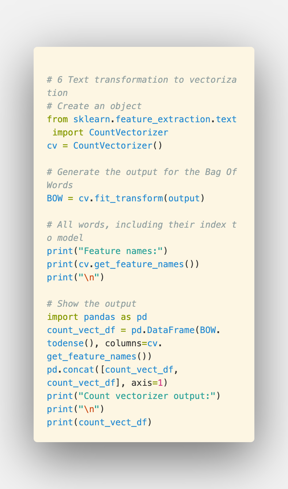
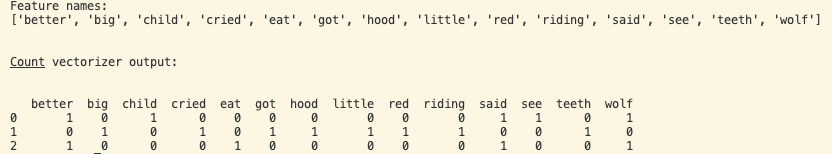

## Prerequisites

By this stage, you should have some understanding of the following packages that will be used in this section for text preprocessing:
* re
* NLTK
* Porter (Stemming)

# Bag of Words
## What is the bag-of-words, or BOW, algorithm?

A method which extracts the essential features from raw text so that we can use it for machine learning models.  We do this by essentially turning the letters of the text into numbers, and feeding the encoded data to the machine learning model. This process is called vectorization. There are several different methods of how to carry out the vectorization of text, such as BOW, TF-IDF and word2vec. Later we will be using the Scikit-Learn library which carries out this operation in a single line of code, but let's work through its implementation. 

The BOW process works by first defining a fixed length vector (an array) that is equal to the length of a pre-defined dictionary of words. Each entry in the dictionary corresponds to the words found in the entire corpus of text given. We then represent some text using the vector, by counting how many times each word of the dictionary appears in the text and mapping this number to the corresponding vector entry in our dictionary.

For example, let's say we have the following dictionary:  {Inclusive, Machine, Learning, learn, here, is, fun}. To represent the following sentence "Machine Learning is fun" using vectorization in the BOW approach, we would have the following vector: (0, 1, 1, 0, 0, 1, 1).

## BOW involves two things:

> A vocabulary of known words.

> A measure of the presence of known words.

“Bag” of words refers to the fact that we don't care about the order of words, only the occurrence of each of the words found in the text. By mapping the occurrence of each of the most used words in a text (not including very frequent or very infrequent words) we can get an idea of the relevant topics of a given text. 

## Applications

1. Deriving the topics from text
2. Information retrieval
3. Document classification

## Pipeline

To achieve this, we put the text through the following pipeline.

## Example

Let's work through an example to better understand each portion of the pipeline above, in full.

### Raw text

Let's say our corpus contains the following sentences:

* "She wanted to go tanning"
* "She saw that the sun was shining"
* "She decided to go tanning in in the sun"

### Clean text

When we work with real data, we would want to properly apply the correct cleaning methods to remove any redundant noise we might find, such as punctuation ad stop words, and would also apply methods such as stemming or lemmatization to normalize variation in the text.

### Tokenize

Convert the sentences in the corpus to individual words, or tokens.
| Sentence 1  | Sentence 2  | Sentence 3  |
|---|---|---|
|She   | She  | She  |
| wanted  |  saw | decided  |
| to   | that  |  to |
|go   | the  | go  |
| tanning | sun |  tanning |
|    | was | in  | 
|   |  shining | the  |
|  |     |  sun |

### Create dictionary of word frequency

Create a dictionary, where the keys are all the words found in the tokenized sentences and the values are their corresponding frequency. If we organize the dictionary by frequency, we can then filter for the most important words in the corpus.

| Word  | Frequency  |
|---|---|
| She | 3 |
| to |  2 |
| go | 2 |
| tanning | 2 |
| the  | 2  |
| sun  |  2 |
| wanted  | 1  |
| saw  |  1 |
| that  | 1  |
| was  | 1  |
| shinning  | 1 |
| decided  |  1 |
| in | 1| 

### Create the BOW model

We then create a matrix, where the words in the dictionary correspond with the columns, and the rows correspond to the sentences.

|   | She  | to  |  go | tanning  | the | sun | wanted | saw | that | was |
|---|---|---|---|---|---|---|---|---|---|---|
| Sentence 1 | 1 | 1 | 1 | 1 | 0 | 0 | 1 | 0 | 0 | 0 |
| Sentence 2  | 1 | 0 | 0 | 0 | 1 | 1 | 0 | 1 | 1 | 1 |
| Sentence 3  | 1 | 1 | 1 | 1 | 1 | 1 | 1 | 0 | 0 | 0 |

To achieve the matrix above, we took the top 10 most frequent words in the dictionary, and plugged those in as column values. Each sentence on the rows is then checked, token by token, for the occurrence of the word. In this way, we will have a binary representation of whether or not the token appears in the sentence. The vector representations of the text can then be fed as encoded data to the BOW model.

## Measuring scores

By marking the presence or absence of words in a sentence, we then start to have a representation of the essential features extracted from a tex

### N-gram BOW model

Additionally, we can create groupings of commonly co-occurring words. A bi-gram, or trigram model, will track the presence of a two or three word pair, respectively. This helps in more accurate topic identification of a document, as we can imagine if we want to preserve the occurrence of a term like 'natural', 'language', and 'preprocessing' for example. 

### Python implementation
[Here we provide the python code](_recipe/01-Introduction/count_vectorizer_example.py) which uses the CountVectorizer function from the scikit learn library to derive the essential features extracted from our input, as seen below. Steps 1-5 indicate the preprocessing portions of our BOW pipeline. Step 6 shows how this function returns the output of essential features and the vector representation of each of our input sentences.

### Results from CountVectorizer

## Limitations
### Size

As the size of the dictionary increases with new encoded data, so too does the length of the vector representing those documents. If we apply this approach on thousands of children's stories for example, the length of the vector could be hundreds of thousands of positions long, with some documents using very few of the tokenized words in the vocabulary. This can create a vector with many zeros, a sparse representation of the data, which is difficult to model in terms of memory restrictions and computational resources. 

Accordingly, strategies to reduce the dimensional space of a BOW model take place at the preprocessing stage, where text is stripped of punctuation, stop words, spelling is corrected and case is normalized.

### Context

Finally, relying simply on the presence of a word and ignoring the order means that the context or semantic content is not included in the model. 

Other common word embedding approaches involve slightly more sophisticated methods of scoring, which we mentioned earlier with TF-IDF and word2vec. These methods attempt to capture the semantic representation of the word embeddings for more accurate feature extraction.
